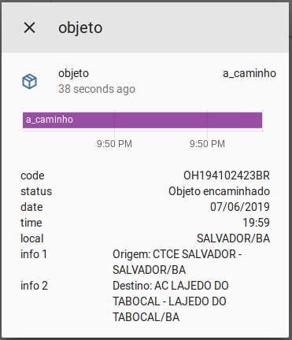

# Sensor for Correios - Brazilian postal service 
The correios platform allows one to track deliveries by [Correios](http://www.correios.com.br/) using [Link & track](https://linketrack.com/) API.

To get started put `/custom_components/correios/sensor.py` here:
`<config directory>/custom_components/correios/sensor.py`

**Example configuration.yaml:**
```yaml
sensor:
  - platform: correios
    code: OH194102423BR
    name: objeto
    scan_interval: 600
```

**Configuration variables:**
  
key | description
:--- | :---
**platform (Required)** | The platform name.
**code (Required)** | (13 digits) The track number.
**name (Optional)** | (String) The name to use when displaying this Transmission instance in the frontend. Defaults to correios.
**scan_interval (Optional)** | (integer) How frequently to query for new data. Defaults to 1800 seconds.

#### Possible sensor states

state | description
:--- | :---
**postado** | Object posted.
**a_caminho** | Object on the way.
**saindo_entrega** | Object left for delivery to recipient.
**entregue** | Object delivered to the recipient.
**entrega_falhou** | Delivery could not be done - Postman was not received.
**tentativa_entrega** | Delivery attempt.
**esperando_retirada** | Object waiting for removal at the indicated address.
**sem_status** | The object was not find in the system.
**erro** | An exception occured.

#### Sample overview


